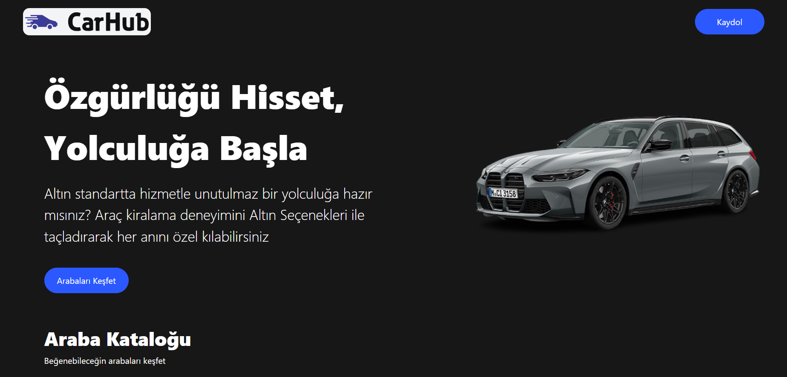
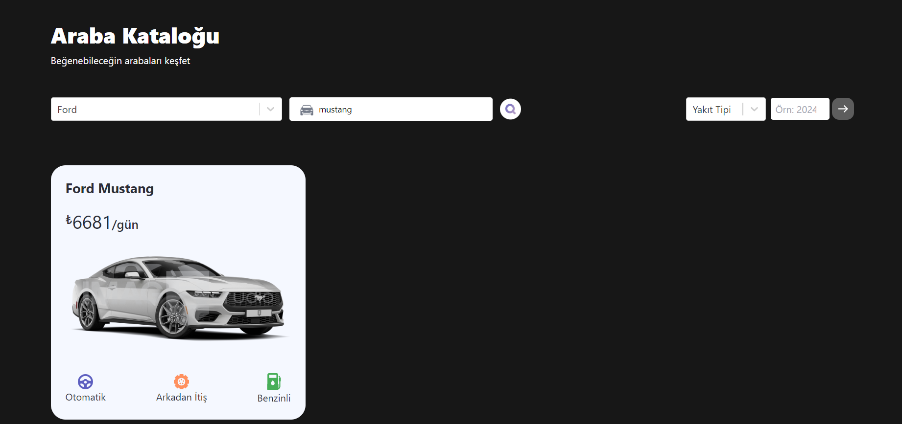
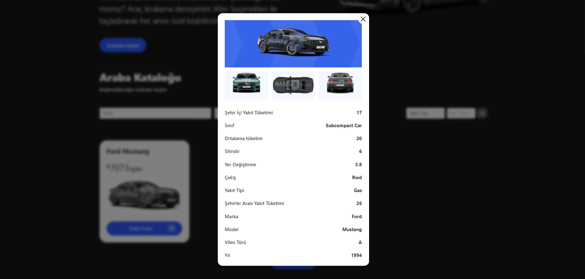

# Araba Katalog Sitesi 🚗

React ve TypeScript ile geliştirilmiş, Tailwind CSS ile stillendirilmiş, araç özelliklerini filtreleyerek arama yapabileceğiniz bir araba katalog sitesi.

## Özellikler ✨

- **Filtreleme Seçenekleri**:
  - Araç Marka
  - Araç Model
  - Yakıt Tipi
  - Üretim Yılı
- **API Desteği**:
  - Araç özellikleri dinamik olarak API'den çekilmektedir.
- **Modern Tasarım**:
  - Tailwind CSS ile responsive ve kullanıcı dostu bir arayüz.

## Kullanılan Teknolojiler 🛠️

- **React**: Komponent tabanlı kullanıcı arayüzü geliştirme.
- **TypeScript**: Güçlü tip kontrolü ve daha güvenli kod yazımı.
- **Tailwind CSS**: Hızlı ve özelleştirilebilir stillendirme.
- **Framer-Motion**: Animasyonlu görseller.
- **Vite**: Hızlı geliştirme ortamı.

## Kurulum 🚀

Projeyi yerel ortamınıza klonlayarak başlatabilirsiniz:

```bash
git clone https://github.com/cengo14/react-typescript-rent-a-car-project.git
cd araba-katalog
npm install
npm run dev
```

## Ekran Görüntüleri 📸

Ana sayfa:  


Filtreleme:  


Filtreleme:  


## API Kullanımı 🌐

Projede kullanılan API, araç bilgilerini ve filtreleme seçeneklerini sağlar. API'yi kullanmak için `.env` dosyanıza aşağıdaki gibi bir anahtar ekleyin:

```env
VITE_API_KEY=https://api.example.com
```

## Katkıda Bulunma 🤝

Katkıda bulunmak için bir **pull request** açabilir veya bir **issue** oluşturabilirsiniz.

## Lisans 📄

Bu proje MIT lisansı ile lisanslanmıştır. Daha fazla bilgi için [LICENSE](./LICENSE) dosyasını inceleyebilirsiniz.

---

Bu proje, kullanıcıların ihtiyaçlarına uygun araçları kolayca bulabilmelerini sağlamak için geliştirilmiştir.
